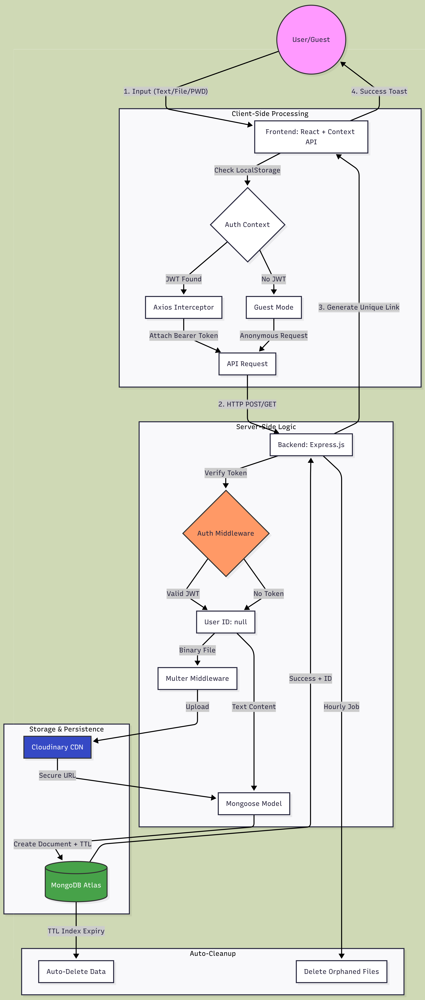

# LinkVault - Data Flow Diagram & System Architecture

> **Assignment Deliverable**: High-level architecture showing data flow from user upload to database storage

---

## 📊 Visual Diagram



---

## � Mermaid Diagram

### Interactive Link
View and edit this diagram in Mermaid Live Editor:

**[Open in Mermaid Live Editor](https://mermaid.live/edit#pako:eNqNVe9v4jgQ_VesrHbVain9QSiQDycBgS4r2EUlvZUuoMpNBsg12DnHuYOr-r_fOLbBW3WlywcT2_NexvPemBcv4Sl4gbcRtNiSKFwygs_Hj-ShBEE-kbHgTAJLyZQeQOhdtXV2psbLuwpKeX5OLi7I0rtukgkrKknOItjLy3GWw-X8R3i-9HD_NzIexZYtIPdAE0k-k6Fa2EvSn09Wml2PZfWkUxrmGTD5uMhSILGeXNSTueAJlGXGNgaonvFIpzLcQvJMpjyh-UJyQTdgkuhXcvuiBvvl1xO4Xq7hX39EZMwrlhrUBENFAgVSxf19xkt3ZfUewzdOkMTA6yrF9UhmWG8H4fBoYF9KmmzJAKhAASL-DMyw3MNfMZZJ_Comh0Qzazjj7LDjVWnDTmAdj9VfsqPKA5o8v1EXIzXVTZN8iaI5mX9fRJd3I3uYwSg2qICM9oVADZp_litLehRuAeJvEEY4PdHCTfkmS5zsB0az30Fk68NPR55laZrDP1gKrdlp7sh2WjQ8NM9Sp_rGKPEkRe-oL9TWnoSrX1Ogem4alsEAA8KqPHfgpzcTqVlUF2ibMStDOHhUfoR4xtmG8xJqP7hcPzEMMkbFgahOshWpcjRMrH-cvFfvqWus76p7kkfvPdZ7KJAJ_UTmIMqsxJwT16fmg3VWD0XOqW2N4TTEtuRVqlMdht8cFG5qyAKSCov7cD99U4hTrF0xDSyASiAhT6odlg9viiiy2Fk4iM_qAoYD0pc5Lc_fPf4YIH2i9T3AC72KUJNQldRl_ox6Ho2tY6wfW01yBwyEyuOBZdhNZJqx5-NtpqPtjeM3ieWMOD32nbLMm37bCHWzWKGhfCPMjGbKMRTrT2J0Pb8Y5kBZVbhq2GNgUfAKSWGvWjETB1tdyEGCRut3ElJJ32m6L7wS-YF85U8nPR_NB2MD_S6KLWWQ1j4sf-G0Q443sTkKTkB32TrL8-DDurdulFJgRwUfWq2WG6VOooP8Dr3xu25cI-E5Fwhfr12IMpWGtHy_m7T_B8Tpb5vRrQvzGvgHmKVeIEUFDW8HYkfV1HtRLEtPbmGHHRjga0oFWmDJXhFTUPYH5zsLQ103Wy9Y07zEWVWk6JwwoyjrKQTLBmKIBpBecH1dU3jBi7f3gpbfa_q-3-n2Ojc4XnUb3sEL2lfNXqvTvrlt37Z7HXx5bXj_1t-8anY77df_ALKgXI4)**

---

## 🔍 Detailed Data Flow Explanation

### 1️⃣ **User Upload Flow** (Guest or Authenticated)

**Step-by-Step Process:**

1. **User Input** → User fills upload form with text or file
2. **Frontend Send** → Form sends POST request to `/api/upload`
   - Data: text/file, password (optional), expiry, view limit
   - Headers: Authorization Bearer token (if logged in)
3. **Auth Check** → Backend middleware checks JWT token
   - If valid → extracts `userId` from token
   - If no token → continues with `userId = null` (guest mode)
4. **File Storage** → If file upload:
   - Backend uploads file to **Cloudinary**
   - Cloudinary returns: `fileUrl`, `publicId`, `resourceType`
5. **Database Save** → Backend creates document in **Contents Collection**:
   ```javascript
   {
     _id: "507f1f77bcf86cd799439011",  // MongoDB unique ID
     type: "file",
     fileUrl: "https://res.cloudinary.com/.../file.pdf",
     cloudinaryPublicId: "uploads/abc123",
     userId: "699223d8bc523fef3ad57b96",  // or null for guest
     passwordHash: "$2b$10$...",  // if password protected
     viewsRemaining: 5,
     expiresAt: "2026-02-16T12:00:00Z",
     createdAt: "2026-02-16T03:00:00Z"
   }
   ```
6. **Link Generation** → Backend generates shareable link:
   - Format: `http://localhost:5173/view/{_id}`
7. **Response** → Backend returns link to frontend
8. **Display** → Frontend shows link to user with copy button

---

### 2️⃣ **User Authentication Flow**

**Registration Process:**

1. User enters name, email, password in Register form
2. Frontend sends POST to `/api/auth/register`
3. Backend validates input (email format, password length)
4. Backend checks if email already exists in **Users Collection**
5. Backend hashes password using **bcrypt** (10 salt rounds)
6. Backend saves user document:
   ```javascript
   {
     _id: "699223d8bc523fef3ad57b96",
     name: "John Doe",
     email: "john@example.com",
     password: "$2b$10$hashed_password_here",
     createdAt: "2026-02-16T03:00:00Z"
   }
   ```
7. Backend generates **JWT token** (expires in 7 days)
8. Frontend stores token in `localStorage`
9. User redirected to Dashboard

**Login Process:**

1. User enters email, password
2. Frontend sends POST to `/api/auth/login`
3. Backend finds user by email in **Users Collection**
4. Backend compares password with stored hash using bcrypt
5. If valid → generate JWT token
6. Frontend stores token in `localStorage`
7. User redirected to Dashboard

---

### 3️⃣ **Dashboard Flow** (Authenticated Users Only)

1. User navigates to `/dashboard`
2. Frontend checks for JWT token in `localStorage`
3. If no token → redirect to `/login`
4. If token exists → send GET to `/api/user/content` with JWT
5. Backend middleware verifies JWT signature
6. Backend extracts `userId` from token payload
7. Backend queries **Contents Collection**:
   ```javascript
   db.contents.find({ userId: "699223d8bc523fef3ad57b96" })
   ```
8. MongoDB returns array of user's content
9. Backend sends content list to frontend
10. Frontend displays content cards in grid layout
11. User can click:
    - **View** → opens content in new page
    - **Delete** → sends DELETE request with JWT

---

### 4️⃣ **Content Access Flow** (Public - Anyone with Link)

1. User opens shared link: `http://localhost:5173/view/{id}`
2. Frontend sends GET to `/api/content/{id}`
3. Backend queries **Contents Collection** by `_id`
4. Backend checks:
   - ❌ If expired → return 404
   - ❌ If view limit reached → return 403
   - ✅ If password protected → request password
5. If file type:
   - Backend fetches file URL from Cloudinary
   - Returns file download link
6. If text type:
   - Returns text content directly
7. Backend decrements `viewsRemaining` if applicable
8. Frontend displays content with copy/download buttons

---

### 5️⃣ **Content Deletion Flow** (Owner Only)

1. User clicks Delete on Dashboard
2. Frontend shows confirmation dialog
3. User confirms → send DELETE to `/api/content/{id}` with JWT
4. Backend verifies JWT and extracts `userId`
5. Backend finds content by `_id` in **Contents Collection**
6. Backend verifies ownership:
   ```javascript
   if (content.userId !== req.user._id) return 403 Forbidden
   ```
7. If file type → Backend deletes from Cloudinary:
   ```javascript
   cloudinary.uploader.destroy(content.cloudinaryPublicId)
   ```
8. Backend deletes document from **Contents Collection**
9. Frontend removes card from UI
10. Success toast notification shown

---

## 🗄️ Database Schema

### Users Collection
```javascript
{
  _id: ObjectId,           // MongoDB unique ID
  name: String,            // User's full name
  email: String,           // Unique, indexed
  password: String,        // bcrypt hashed, select: false
  createdAt: Date,         // Auto-generated
  updatedAt: Date          // Auto-generated
}
```

### Contents Collection
```javascript
{
  _id: ObjectId,                  // MongoDB unique ID (used in URL)
  type: "text" | "file",          // Content type
  text: String | null,            // Text content if type=text
  fileUrl: String | null,         // Cloudinary URL if type=file
  cloudinaryPublicId: String | null,  // For deletion
  originalFileName: String | null,    // Original file name
  passwordHash: String | null,    // bcrypt if password protected
  viewsRemaining: Number | null,  // View limit counter
  userId: ObjectId | null,        // Reference to Users (null=guest)
  expiresAt: Date,                // TTL index field
  createdAt: Date,
  updatedAt: Date
}
```

**TTL Index**: MongoDB automatically deletes documents where `expiresAt < current time`

---

## 🔐 Security Implementation

### Password Hashing
- **Algorithm**: bcrypt with 10 salt rounds
- **Storage**: Never store plain text passwords
- User passwords in `Users` collection
- Upload passwords in `Contents` collection

### JWT Authentication
- **Generation**: Signed with `JWT_SECRET` from environment
- **Expiration**: 7 days (configurable via `JWT_EXPIRE`)
- **Storage**: Client-side in `localStorage`
- **Transmission**: `Authorization: Bearer <token>` header
- **Verification**: Middleware checks signature and expiration

### Access Control
1. **Link-based**: MongoDB ObjectID (24 hex characters, hard to guess)
2. **Password protection**: Optional bcrypt-hashed password per content
3. **View limits**: Counter decrements, content inaccessible when 0
4. **Ownership**: Only content owner can delete
5. **No public listing**: No API to browse all content

---

## 🛠️ Technology Stack

| Component | Technology | Purpose |
|-----------|------------|---------|
| **Frontend** | React + Vite | Single-page application, fast builds |
| **Routing** | React Router | Client-side routing |
| **Styling** | CSS3 | Glassmorphism design |
| **State Management** | Context API | Authentication state |
| **HTTP Client** | Axios | API requests with interceptors |
| **Backend** | Node.js + Express | Server runtime and framework |
| **Authentication** | JWT + bcrypt | Token auth and password hashing |
| **File Upload** | Multer | Multipart form data handling |
| **File Storage** | Cloudinary | Cloud storage with CDN |
| **Database** | MongoDB Atlas | Cloud NoSQL database |
| **ODM** | Mongoose | Schema validation and queries |

---

## 📡 API Endpoints Summary

| Endpoint | Method | Auth | Purpose |
|----------|--------|------|---------|
| `/api/auth/register` | POST | ❌ | Create new user account |
| `/api/auth/login` | POST | ❌ | Login to existing account |
| `/api/auth/me` | GET | ✅ | Get current user info |
| `/api/upload` | POST | Optional | Upload text/file |
| `/api/user/content` | GET | ✅ | Get user's all content |
| `/api/content/:id` | GET | ❌ | View content by ID |
| `/api/content/:id` | DELETE | ✅ | Delete own content |

---

## 🔗 Live Diagram Links

### Mermaid Live Editor (Editable)
View and edit this diagram online:
[https://mermaid.live/edit](https://mermaid.live/edit)

Copy the Mermaid code from above and paste it into the editor.

### Generated Diagram
The visual diagram is saved as: `data_flow_diagram.png`

---

## 📝 Assignment Compliance

✅ **Data flow from user upload to DB storage** - Shown in detailed steps  
✅ **High-level architecture** - Complete system overview included  
✅ **Created with online tool** - Mermaid Live Editor (like Whimsical)  
✅ **Shows all components** - User, Frontend, Backend, Cloudinary, MongoDB  
✅ **Clear flow indicators** - Numbered steps and directional arrows  
✅ **Includes both flows** - Authenticated and guest uploads  

---

**Created**: February 16, 2026  
**Assignment**: LinkVault Take-Home Project  
**Tool Used**: Mermaid Live Editor (Online Diagram Tool)  
**Format**: Markdown with embedded Mermaid code (renders on GitHub)
